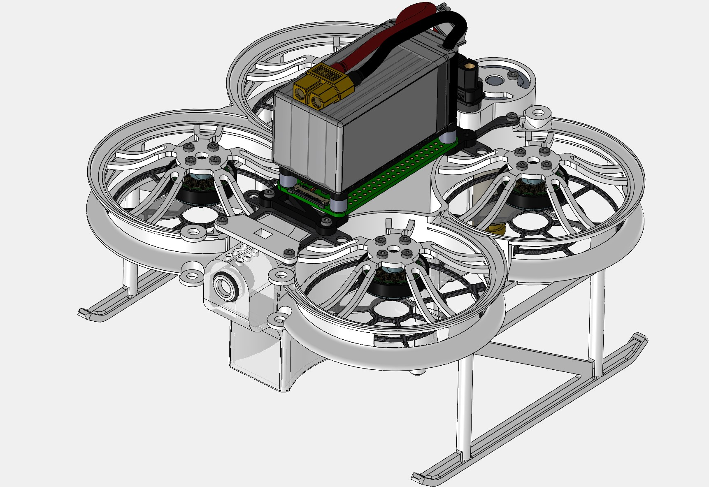

# Autonomous Indoor Drone Swarm Sanitation System

## Description  

Created by Colin Laganier under the supervision of Prof. Robert Shorten as part of the MEng Final Year Project. 

Progress can be followed on the regularly update logbook for additional information about the project: [https://bit.ly/3Ni6ypL](https://bit.ly/3Ni6ypL)

## Hardware

Solidworks Hardware Assembly
<!-- &nbsp; -->
 
The drone is built upon the Diatone Taycan C25 MK2 frame, with 2004 BetaFPV brushless DC Motors and a Flywoo Goku GN745 Flight Controller ESC unit running ArduCopter 4.1.5 firmware. To fit its purpose of a sanitation drone the following pieces were designed and added:
* Transparent Nylon 100mL Water tank, fitted with a refill valve and a silicone coating to ensure watertightness.
* Waterpump and PLA support for spraying of the cleaning solution.
* Acrylic Raspberry Pi Zero support.
* PLA legs.  

## PCB

Altium Designer PCB Assembly

## Room Mapping

## Positioning

## Motion Planning
