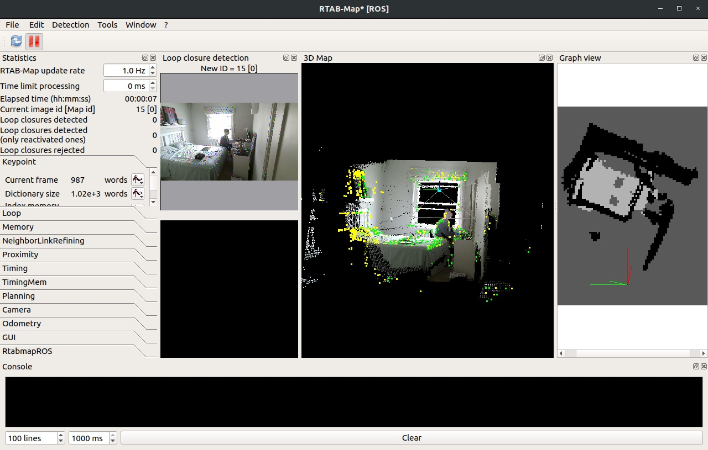

# Autonomous Indoor Drone Swarm Sanitation System

## Description  

Created by Colin Laganier under the supervision of Prof. Robert Shorten as part of the MEng Final Year Project. 

Progress can be followed on the regularly update logbook for additional information about the project: [https://bit.ly/3Ni6ypL](https://bit.ly/3Ni6ypL)

## Hardware

Solidworks Hardware Assembly
<!-- &nbsp; -->
 
The drone is built upon the Diatone Taycan C25 MK2 frame, with 2004 BetaFPV brushless DC Motors and a Flywoo Goku GN745 Flight Controller ESC unit running ArduCopter 4.1.5 firmware. To fit its purpose of a sanitation drone the following pieces were designed and added:
* Transparent Nylon 100mL Water tank, fitted with a refill valve and a silicone coating to ensure watertightness.
* Waterpump and PLA support for spraying of the cleaning solution.
* Acrylic Raspberry Pi Zero support.
* PLA ski-style landing gear support legs.  

The control software is running on a Raspberry Pi Zero 2 W running Debian on each drone, connected to a central PC running Ubuntu 16.04 using a TCP/IP communication.  

Communication Architecture of Proposed Solution

## PCB

Altium Designer PCB Assembly

A custom PCB was designed to hold together the DWM1001C module from Decawave, as well as a MPU6050 IMU and a QMC5883L Compass for positioning; as well as a DRV8871 to control the spraying pump. The focus of the PCB is ensuring a small footprint to house all of the components on a small size platform. The PCB was designed with Altium Designer and manufactured and assembled by JLCPCB.

## Room Mapping

The room mapping is done using ROS running on an Linux PC using three Kinects v2 and the libfreenect2 driver with CUDA acceleration. The room mapping is done using RTAB-Map to create a 2D grid array of the furniture in the lecture hall. 

Screenshot of the RTAB-Map Development GUI

## Positioning

The positioning system rely on the DWM1001C Ultra-Wideband chip by Decawave and used an asymetric two-way ranging positioning system designed by Decawave. This system provides a sub-20cm positioning error within the tested environment. The ranging data is fetched from the IC by the Raspberry Pi, reformated and fed into the Arducopter Extended Kalman Filtering positioning system where it is combined with IMU, barometer and compass data.

